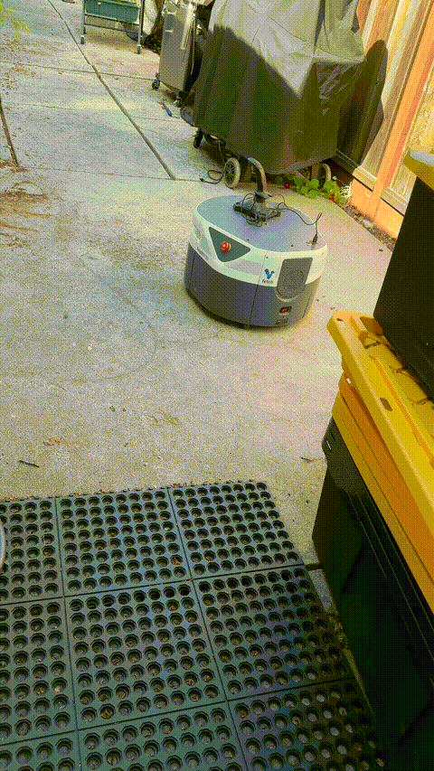
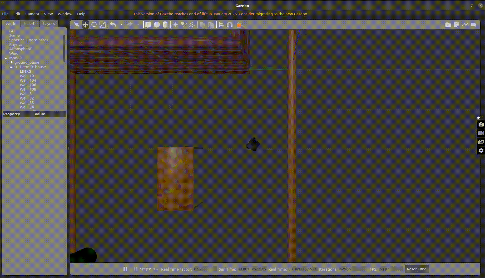

# Behavior-Level Autonomous Navigation with LiDAR Safety Arbitration (ROS)
Deployed and validated on a Fetch Robotics AMR — real hardware, ROS Noetic over WiFi.

# Final Result - Simmlation & Real Hardware




## Overview
 
A behavior-level autonomy stack for a differential-drive mobile robot. Separates motion generation, safety enforcement, and command arbitration into three independent ROS nodes — making the system safe, debuggable, and extensible.
 
Validated in Gazebo simulation (TurtleBot3) and deployed to a **Fetch Robotics AMR** at a community robotics workspace.
 
---
 
## Architecture
 
```
Controller Node  ──► /desired_cmd_vel ──┐
                                        ├──► Velocity Arbiter ──► /cmd_vel ──► Robot
LiDAR Safety Node ──► /safety_cmd_vel ──┘
       ▲
  /base_scan (Fetch) / /scan (simulation)
```
 
### Nodes
 
**`controller_node.py`** — Motion generation
- Executes waypoint-based trajectories (square, figure-8)
- Publishes desired velocity on `/desired_cmd_vel`
- Pure motion logic with no obstacle awareness — safety handled downstream
- Publishes waypoint markers for RViz visualization
**`lidar_obstacle_mgmt.py`** — LiDAR safety layer
- Subscribes to `/scan` (simulation) or `/base_scan` (Fetch hardware)
- Extracts forward arc LiDAR data with configurable angle bounds
- Computes minimum obstacle distance and Time-To-Collision (TTC)
- Publishes speed-limited safety velocity on `/safety_cmd_vel`
- Visualizes forward safety arc in RViz (color-coded: stop vs safe)
**`lidar_movement_arbiter.py`** — Velocity arbitration + state machine
- Subscribes to `/desired_cmd_vel` and `/safety_cmd_vel`
- Safety always overrides motion — publishes final velocity on `/cmd_vel`
- Publishes robot state on `/robot_state`: `IDLE | MOVE | SLOW | STOP`
---
 
## Safety Logic
 
Speed is determined by the more conservative of two metrics:
 
| Condition | Behavior |
|---|---|
| Distance ≤ `stop_distance` OR TTC ≤ `ttc_stop` | Hard stop |
| Distance ≥ `safe_distance` AND TTC ≥ `ttc_slow` | Full speed |
| Otherwise | Scaled speed (min of distance-based and TTC-based scaling) |
 
Hysteresis prevents oscillation at threshold boundaries.
 
---
 
## Hardware Deployment — Fetch Robotics AMR
 
Deployed to a Fetch AMR over WiFi (ROS Noetic, Ubuntu 20.04 laptop as remote client).
 
Key sim-to-real adaptations:
- Topic remapped from `/scan` → `/base_scan` (Fetch's Hokuyo UTM-30LX LiDAR)
- Forward arc indices recalculated for Fetch's 270° LiDAR FOV
- Velocity limits reduced to 0.2 m/s linear, 0.5 rad/s angular for initial runs
- Sensor watchdog added — publishes zero velocity on scan timeout
- `on_shutdown` handler ensures robot stops cleanly on Ctrl+C
- Nodes launched manually via `rosrun` (roslaunch conflicts with robot's existing roscore)
---
 
## Parameters
 
All tunable at runtime via ROS parameter server or launch file:
 
| Parameter | Description | Default |
|---|---|---|
| `stop_distance` | Hard stop threshold (m) | 0.6 |
| `safe_distance` | Resume full speed threshold (m) | 1.2 |
| `moving_speed` | Maximum forward speed (m/s) | 0.6 |
| `front_min_angle` | Left bound of forward arc (degrees) | -30 |
| `front_max_angle` | Right bound of forward arc (degrees) | 30 |
| `ttc_stop` | Emergency stop TTC threshold (seconds) | 0.8 |
| `ttc_slow` | Resume full speed TTC threshold (seconds) | 1.5 |
 
---
 
## Running in Simulation
 
```bash
# Terminal 1 — launch Gazebo
roslaunch turtlebot3_gazebo turtlebot3_house.launch
 
# Terminal 2 — launch controller stack
roslaunch ros-closed-loop-controller-node controller.launch
```
 
## Running on Fetch Hardware
 
```bash
# Set environment (add to ~/.bashrc for persistence)
export ROS_MASTER_URI=http://<ROBOT_IP>:11311
export ROS_IP=$(hostname -I | awk '{print $1}')
 
# Terminal 1 — controller
rosrun ros_closed_loop_controller_node controller_node.py
 
# Terminal 2 — LiDAR safety
rosrun ros_closed_loop_controller_node lidar_obstacle_mgmt.py _scan_topic:=/base_scan
 
# Terminal 3 — velocity arbiter
rosrun ros_closed_loop_controller_node lidar_movement_arbiter.py
```
 
---
 
## rosbag Support
 
```bash
rosbag record -O run.bag /cmd_vel /safety_cmd_vel /robot_state /odom /scan
rosbag play run.bag  # offline replay for debugging
```
 
---
 
## Design Decisions
 
- **Safety always overrides motion** — arbiter enforces this structurally, not conditionally
- **Three-node separation** — each node has one responsibility; any can be restarted independently
- **Explicit state publication** — `/robot_state` makes system behavior observable from any terminal
- **Reactive over predictive** — intentional; complexity added only where needed (see next project)
---
 
## Skills Demonstrated
 
- ROS node architecture, pub/sub message flow, parameter server
- LiDAR data processing — forward arc extraction, sector-wise range filtering
- Time-To-Collision computation and distance-based velocity scaling
- Velocity arbitration and behavior-level finite state machine
- Sim-to-real deployment on a Fetch Robotics AMR
- Hardware debugging: ROS distributed networking, safety interlock diagnosis, topic namespace management
---
 
## Status
 
✅ Complete and validated on real hardware
🔧 Next: Predictive local planner with forward trajectory simulation and curvature-aware collision checking
 